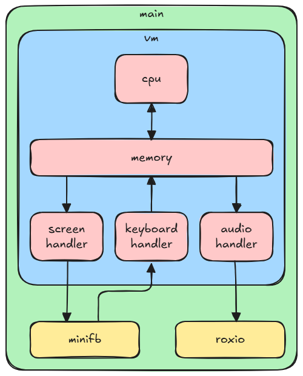

# RustedBytes - A BytePusher VM in Rust


RustedBytes-BytePuhser is a Rust implementation of the BytePusher Virtual Machine, a simple virtual computer architecture designed for demoscene programming and low-level system experimentation.

## What is the BytePusher VM?

The BytePusher VM is a minimalist virtual machine, created to be easy to implement and understand. It is often used to produce demos, games, or visual and audio experiments, thanks to its deterministic architecture and directly accessible video/audio memory.

Main features of the BytePusher VM:

- 16 MiB linear memory
- Color video framebuffer (typically 256x256 pixels)
- 8-bit audio
- No conditional instructions: only copy and jump operations

For more details on the BytePusher VM specification, see the references below.

## Implementation



This project implements the BytePusher VM in Rust, using:

- **minifb** for window and video framebuffer management
- **rodio** for audio output
- **clap** for command-line argument parsing

The project structure is modular:

- `cpu.rs`: BytePusher CPU logic
- `memory.rs`: virtual memory management
- `screen.rs`: framebuffer rendering
- `audio.rs`: audio generation and output
- `keyboard.rs`: keyboard input handling
- `vm.rs`: virtual machine orchestration
- `main.rs`: application entry point

To run a BytePusher ROM:

```sh
cargo run --release -- <rom.BytePusher> [--scale <fattore>]
```

### Opzioni

- `--scale <fattore>`: imposta il fattore di scaling della finestra (valori ammessi: 1, 2). Il valore predefinito è 1.

Esempio:

```sh
cargo run --release -- roms/Nyan.BytePusher --scale 2
```

## References

- [BytePusher specification (esolangs.org)](https://esolangs.org/wiki/BytePusher)
- [BytePusher reference implementation (GitHub)](https://github.com/gwern/BytePusher)
- [minifb crate (docs.rs)](https://docs.rs/minifb/)
- [rodio crate (docs.rs)](https://docs.rs/rodio/)
